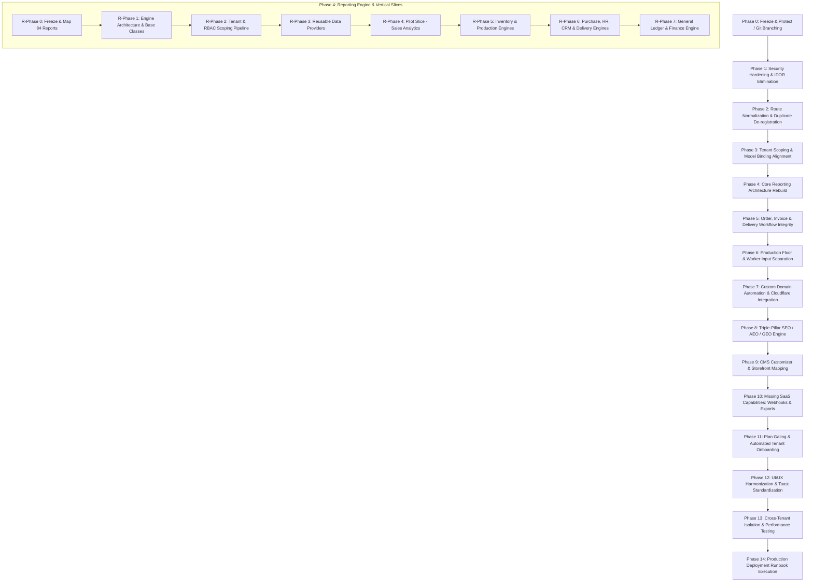

# ProERP Master Implementation Roadmap

**Platform:** Enterprise Multi-Tenant SaaS ERP & Storefront Platform (`slicemart-fms`)  
**Target Domains:** `proerp.devcenterpoint.com` (Master Panel / ERP), `*.devcenterpoint.com` (Subdomain Storefronts), Custom Domains (Enterprise Tenant Whitelabeling)  
**Status:** Audit Approved — Ready for Phase 0 Execution  

---

## 1. Executive Summary & Architectural Vision

Following an exhaustive audit of all 692 backend routes, 852 frontend API call sites, 207 database migrations, and 84 catalogued reports, this roadmap establishes the definitive, dependency-ordered engineering plan to transform `slicemart-fms` into an enterprise-grade multi-tenant SaaS ERP.

### Core Architectural Directives
1. **Zero Fake Data in Production:** Completely decommission `RunReportQueryAction::generateGenericReportData()` and replace mock garment data with authentic, tenant-scoped database aggregations.
2. **Strict Multi-Tenant Isolation:** Eliminate the report `$filters['tenant_id']` IDOR vulnerability, enforce `BelongsToTenant` across all 165 models, and align route-model binding order with tenant resolution.
3. **Domain-Driven Entity Separation:** Strictly decouple the sales and fulfillment lifecycles: `Order` (commercial intent) ≠ `Sale / Invoice` (financial claim) ≠ `Payment` (cash collection) ≠ `Delivery` (logistics fulfillment).
4. **Reusable Data Provider Architecture:** Consolidate 84 disparate reports into 12 core reporting engines rather than maintaining 84 isolated SQL scripts.
5. **Brand Agnosticism:** Purge all hardcoded "Slice Mart" references from core services (`SeoMetadataService`, `RefreshTokenService`, `SliceMartBrainService`) to support true white-label multi-tenancy.

---

## 2. High-Level Dependency Graph



---

## 3. Detailed Master Implementation Phases

### Phase 0: Freeze & Protect Current System
- **Objective:** Establish a safe, reversible baseline before making platform-wide modifications.
- **Tasks:**
  1. Create dedicated Git branch `refactor/saas-architecture-and-reporting`.
  2. Perform full database snapshot (`mysqldump`) and store in secure local backup directory.
  3. Freeze report UI modifications in `src/pages/reports/*`.
  4. Generate and lock dependency maps for `reportCatalogue.ts`, `ReportDefinitionsTableSeeder.php`, and dashboard KPI widgets.
- **Affected Files:**
  - Git repository branches and tags.
- **Risks:** Premature modifications during audit freeze.
- **Acceptance Criteria:**
  - [ ] Branch active with zero uncommitted changes.
  - [ ] Database backup verified via local test restore.

---

### Phase 1: Immediate Security Hardening & IDOR Elimination
- **Objective:** Seal critical security vulnerabilities identified in the audit.
- **Tasks:**
  1. **Fix Report IDOR:** Refactor all active report queries (`SalesPerformanceReportQuery`, `StockValuationReportQuery`, `ProductionYieldReportQuery`, `GeneralLedgerSummaryReportQuery`, `PayrollSummaryReportQuery`) to strictly read `$tenantId = TenantContext::id()` or `auth()->user()->tenant_id`. Reject user-supplied `tenant_id` query parameters.
  2. **Add Missing `BelongsToTenant`:** Attach global scope trait to `TenantProductionStage`, `TenantQcTemplate`, `TenantQcCheck`, `TenantModule`, and `TenantUsageCounter`.
  3. **Fix Route Model Binding Timing:** Move `SubstituteBindings` middleware in `bootstrap/app.php` to execute strictly after `tenant.resolve`.
  4. **Purge Brand Hardcoding:** Remove "Slice Mart" literals from `RefreshTokenService.php` cookie keys and `SeoMetadataService.php`.
- **Affected Files:**
  - `backend/app/Modules/Reports/Queries/*.php`
  - `backend/app/Models/Tenant*.php`
  - `backend/bootstrap/app.php`
  - `backend/app/Modules/Auth/Services/RefreshTokenService.php`
  - `backend/app/Modules/Storefront/Services/SeoMetadataService.php`
- **Acceptance Criteria:**
  - [ ] Manual curl with `?tenant_id=2` by Tenant 1 user returns Tenant 1 data only.
  - [ ] Unscoped database queries on `TenantProductionStage` automatically append `WHERE tenant_id = ?`.

---

### Phase 2: Route Normalization & Duplicate De-registration
- **Objective:** Eliminate the 115 redundant route registrations across 51 controller actions.
- **Tasks:**
  1. Audit `routes/api_tenant.php` and remove redundant alias blocks (e.g., duplicated `/api/v1/hrm/employees` and `/api/v1/tenant/employees`).
  2. Establish canonical RESTful conventions (`GET /resource`, `POST /resource`, `GET /resource/{id}`, `PUT /resource/{id}`, `DELETE /resource/{id}`).
  3. Clean frontend API client call sites in `src/api/*` and `src/services/*` to target only canonical URLs, eliminating secondary `.catch()` fallback chains.
- **Affected Files:**
  - `backend/routes/api_tenant.php`
  - `src/api/*.ts`
  - `src/services/*.ts`
- **Acceptance Criteria:**
  - [ ] `php artisan route:list` count drops from 692 to ~577 cleanly mapped routes.
  - [ ] Frontend network tab shows zero 404 retries on standard entity CRUD.

---

### Phase 3: Tenant Scoping & Pipeline Middleware Refactor
- **Objective:** Ensure end-to-end security and subscription compliance across every tenant request.
- **Tasks:**
  1. Introduce `EnsureModuleActive` middleware verifying that the tenant's active plan subscription includes the requested module before entering controllers.
  2. Apply `tenant.quota` middleware to user creation, branch creation, and sales orders.
  3. Ensure all tenant background jobs (`QueuedReportGenerationJob`, `DeliverWebhookPayloadJob`) carry explicit tenant execution context.
- **Affected Files:**
  - `backend/app/Core/Http/Middleware/EnsureModuleActive.php`
  - `backend/bootstrap/app.php`
  - `backend/routes/api_tenant.php`
- **Acceptance Criteria:**
  - [ ] Tenants on Basic plan receive HTTP 403 when requesting HRM or Manufacturing endpoints.
  - [ ] Background queue workers execute queries scoped to the tenant that dispatched them.

---

### Phase 4: Core Reporting Engine Rebuild (The 17-Phase Plan)

Following the user's endorsed architectural roadmap, Reporting will be rebuilt as a proper platform subsystem in strict dependency order:

```
Report Definition -> Data Provider -> RBAC Scope -> Tenant Scope -> Query Builder -> Aggregations -> Dataset -> Presentation / Export
```

#### R-Phase 0: Freeze & Protect Current System
Document the 84 reports, map frontend dependencies (`reportCatalogue.ts`), and preserve report keys for backwards compatibility.

#### R-Phase 1: Build the Reporting Architecture
Construct the backend reporting subsystem directory layout:
```
Reports/
├── Definitions/     # Metadata, columns, filters, permissions, export formats
├── Queries/         # Base query builder abstractions
├── DataProviders/   # Reusable domain data aggregators
├── Filters/         # Standardized filter handlers (Date, Branch, Warehouse, Product)
├── Services/        # Report execution and orchestration service
├── Exporters/       # Excel (FastExcel/PhpSpreadsheet), CSV, PDF formatters
└── Print/           # HTML/CSS print engine templates
```

#### R-Phase 2: Tenant & Permission Scoping Engine
Build the security wrapper that automatically applies branch, warehouse, factory, and salesman filters according to the authenticated user's role.

#### R-Phase 3: Real Data Layer & Reusable Data Providers
Create core data providers instead of 84 individual queries:
- `SalesDataProvider`
- `InventoryDataProvider`
- `ProductionDataProvider`
- `PurchaseDataProvider`
- `HRDataProvider`
- `FinanceDataProvider`
- `DeliveryDataProvider`
- `EcommerceDataProvider`

#### R-Phase 4: Pilot Vertical Slice — Sales Analytics Engine
- **Why First:** Touches customers, products, invoices, payments, salesmen, gross profit, permissions, tenant scope, dashboards, filters, exports, and printing.
- **Implementation:**
  - Build `SalesDataProvider` calculating Revenue, COGS, Gross Profit, Margin %, and Outstanding Balances.
  - Expose logical views: Summary, By Product, By Customer, By Salesman, By Branch, By Payment Method.
  - Connect to frontend `<ReportTable />` with sorting, grouping, pagination, and date-range pickers.
  - Test and verify against actual sales invoices.

#### R-Phase 5: Inventory Engine
Build data providers for Stock Balance, Stock Ledger, Stock Movement, Stock Valuation (FIFO/Weighted Average), Low Stock Alerts, and Warehouse Transfers.

#### R-Phase 6: Production Engine
Build data providers for Production Summary, Target vs. Actual, Worker Production, Material Consumption (BOM vs. Actual), Yield, Wastage, and Rework Orders. Preserve strict separation between line-level input and worker input.

#### R-Phase 7: Purchase Engine
Build data providers for Purchase Orders, Supplier Performance, Purchase Returns, Accounts Payable Aging, and Purchase Price Variance.

#### R-Phase 8: HR & Workforce Engine
Build data providers for Attendance, Employee Production Log, Target vs. Achievement %, Payroll Summary, and Piece-Rate Incentive Calculations.

#### R-Phase 9: CRM & Lead Engine
Build data providers for Lead Volume by Source, Lead Conversion Rate, Pipeline Velocity, and Sales Rep Target vs. Converted Sales.

#### R-Phase 10: Order & Delivery Engine
Build data providers for Order Fulfillment Time, Courier Performance (Steadfast, Pathao, RedX), Delivery Success Rate, Return/RTO Rate, and COD Reconciliation.

#### R-Phase 11: Finance & Accounting Engine
Build data providers for General Ledger, Trial Balance, Profit & Loss (P&L), Balance Sheet, Accounts Receivable Aging, and Cash Flow.

#### R-Phase 12: Implement Unified Report Catalogue & Filter System
- Consolidate the 84 reports into ~50-60 rich, filterable report views in `reportCatalogue.ts`.
- Standardize reusable frontend components: `<ReportHeader />`, `<ReportFilters />`, `<ReportSummaryCards />`, `<ReportTable />`, `<ReportExport />`, `<ReportPrint />`.

#### R-Phase 13: Export & Document Printing System
Integrate server-side CSV and XLSX streaming for large datasets; provide clean A4 portrait and landscape print templates via browser CSS `@media print`.

#### R-Phase 14: Dashboard Integration
Refactor executive dashboard KPI widgets to consume the exact same `DataProviders` as reporting, preventing discrepancies between dashboard numbers and report figures.

#### R-Phase 15: Cross-Tenant Security & Accuracy Testing
Validate calculations manually (Opening + In - Out ± Adj = Closing; Invoice - Cost = Gross Profit); verify Tenant A never sees Tenant B data.

#### R-Phase 16: Complete Decommissioning of Fake Mock Data
Completely delete `generateGenericReportData()` from `RunReportQueryAction.php`. Unpopulated reports return authentic empty states with zero fictional garment records.

#### R-Phase 17: Final QA & Visual Verification
End-to-end testing across desktop, tablet, and mobile views; benchmark query response times under 50,000-row test datasets.

---

### Phase 5: Order, Invoice & Delivery Workflow Integrity
- **Objective:** Eliminate confusion between commercial orders, legal invoices, and physical deliveries.
- **Tasks:**
  1. Enforce strict lifecycle transitions in state machines:
     - Storefront Order (`Pending` → `Confirmed` → `Processing`)
     - Invoice Generation (`Draft` → `Issued` → `Paid / Partial / Unpaid`)
     - Dispatch & Fulfillment (`Manifested` → `Handed_To_Courier` → `In_Transit` → `Delivered / Returned`)
  2. Ensure payments attach to Invoices or Orders via ledger transactions, never by directly mutating order status strings without an audit record.
- **Affected Files:**
  - `backend/app/Modules/Sales/Actions/*.php`
  - `backend/app/Modules/Delivery/Actions/*.php`
  - `backend/app/Modules/Invoices/Actions/*.php`
- **Acceptance Criteria:**
  - [ ] Canceling an order automatically cancels linked unfulfilled deliveries and releases inventory reservations.
  - [ ] Generating an invoice creates proper accounts receivable ledger entries.

---

### Phase 6: Production Floor & Worker Input Subsystem Integrity
- **Objective:** Preserve separation between line-level input and individual worker claims.
- **Tasks:**
  1. Maintain `production_batches` as the master line-level record of actual finished goods output.
  2. Maintain `worker_production_entries` as individual worker claims for piece-rate compensation.
  3. Build the reconciliation supervisor view: Highlight discrepancies where sum of worker claims exceeds batch output by >2%, requiring supervisor sign-off before payroll posting.
- **Affected Files:**
  - `backend/app/Modules/Production/Actions/*.php`
  - `src/pages/production/WorkerEntryView.tsx`
  - `src/pages/production/BatchReconciliationView.tsx`
- **Acceptance Criteria:**
  - [ ] Worker piece-rate entries cannot auto-inflate the tenant's finished goods inventory ledger.
  - [ ] Reconciliation reports clearly separate "Batch Actuals" from "Worker Claims".

---

### Phase 7: Custom Domain Automation & Cloudflare Gateway
- **Objective:** Deliver true SaaS white-labeling with automated SSL certificates.
- **Tasks:**
  1. Implement `CustomDomainService` integrating with Cloudflare Custom Hostnames (SSL for SaaS) API.
  2. Implement DNS verification polling job (`CheckDomainDnsJob`) validating TXT and CNAME records.
  3. Wire frontend custom domain management UI in Tenant Settings with real-time status indicators (`Pending DNS`, `Active`, `Failed`).
- **Affected Files:**
  - `backend/app/Modules/Platform/Services/CustomDomainService.php`
  - `backend/app/Modules/Platform/Jobs/VerifyCustomDomainJob.php`
  - `src/pages/settings/CustomDomainSettings.tsx`
- **Acceptance Criteria:**
  - [ ] Adding a custom domain provisions Cloudflare hostname fallback.
  - [ ] Requests to `customtenant.com` correctly resolve the tenant and render their branded storefront.

---

### Phase 8: Triple-Pillar SEO / AEO / GEO Engine
- **Objective:** Maximize organic search discovery and AI answer engine indexing.
- **Tasks:**
  1. Refactor `SeoMetadataService` to dynamically source brand names, social graphics, and metadata from tenant configuration instead of hardcoded fallbacks.
  2. Generate structured JSON-LD schemas: `Organization`, `WebSite`, `Product`, `BreadcrumbList`, and `FAQPage`.
  3. Expose dynamically generated `/robots.txt` and `/sitemap.xml` tailored to each tenant's published catalog.
  4. Ensure SSR/Prerender or clean HTML meta tags are emitted for crawler user agents (Googlebot, GPTBot, PerplexityBot).
- **Affected Files:**
  - `backend/app/Modules/Storefront/Services/SeoMetadataService.php`
  - `backend/app/Modules/Storefront/Controllers/SitemapController.php`
  - `src/components/storefront/SeoHead.tsx`
- **Acceptance Criteria:**
  - [ ] Google Rich Results Test validates 100% valid schema markup with zero errors.
  - [ ] Subdomain and custom domain sitemaps index only active, in-stock products.

---

### Phase 9: CMS Customizer & Storefront Mapping
- **Objective:** Enable non-technical tenant owners to customize their e-commerce storefronts.
- **Tasks:**
  1. Connect `CmsCustomizer.tsx` to backend `theme_settings` and `cms_sections` tables.
  2. Provide live preview with iframe communication for instant style updates (colors, fonts, banners, featured categories).
  3. Support section reordering, visibility toggling, and multi-banner promotional carousels.
- **Affected Files:**
  - `src/pages/cms/CmsCustomizer.tsx`
  - `backend/app/Modules/Storefront/Controllers/CmsSectionController.php`
- **Acceptance Criteria:**
  - [ ] Theme changes saved in the admin customizer reflect on the public storefront within 5 seconds.

---

### Phase 10: Missing SaaS Capabilities: Webhooks & Data Exports
- **Objective:** Provide enterprise extensibility and compliance.
- **Tasks:**
  1. Expose CRUD APIs and frontend UI for managing `webhook_endpoints` and inspecting `webhook_deliveries`.
  2. Implement `DeliverWebhookPayloadJob` with exponential backoff and HMAC-SHA256 signature verification.
  3. Build `TenantDataExportJob` allowing tenant admins to download an encrypted `.zip` containing CSV dumps of their entire tenant database.
- **Affected Files:**
  - `backend/app/Modules/Integrations/Controllers/WebhookController.php`
  - `backend/app/Modules/Integrations/Jobs/DeliverWebhookPayloadJob.php`
  - `backend/app/Modules/Platform/Jobs/TenantDataExportJob.php`
  - `src/pages/settings/WebhookSettingsView.tsx`
- **Acceptance Criteria:**
  - [ ] Triggering an order creates a webhook delivery log with HTTP response status code.
  - [ ] Tenant export delivers a clean, uncorrupted zip archive containing only that tenant's records.

---

### Phase 11: Plan Gating & Automated Tenant Onboarding
- **Objective:** Monetize features through subscription tiers and streamline tenant registration.
- **Tasks:**
  1. Implement automated provisioning upon tenant registration: automatically seed default Chart of Accounts, default Warehouse, default Unit conversions, and default Document Numbering Sequences.
  2. Enforce plan-level feature gates across both backend API routes (`module.active`) and frontend navigation sidebars.
  3. Implement tenant maintenance mode interception (HTTP 423 Locked with styled customer maintenance page).
- **Affected Files:**
  - `backend/app/Modules/Platform/Actions/ProvisionTenantDefaultsAction.php`
  - `backend/app/Core/Http/Middleware/EnsureModuleActive.php`
  - `src/components/navigation/Sidebar.tsx`
- **Acceptance Criteria:**
  - [ ] Newly registered tenant can immediately create an invoice without manual warehouse or tax setup.
  - [ ] Disabled modules are hidden in navigation and blocked at the API gateway.

---

### Phase 12: UI/UX Harmonization & Toast Notification Standardization
- **Objective:** Eliminate interface friction and create a unified, premium user experience.
- **Tasks:**
  1. Standardize all toast notifications on `sonner`, eliminating conflicting notification libraries.
  2. Implement standardized `<ReportTable />` with saved column presets, quick search, date shortcuts (Today, This Week, This Month, Last Quarter), and export buttons.
  3. Verify touch-friendly responsive layouts across all mobile, tablet, and high-DPI desktop viewports.
- **Affected Files:**
  - `src/components/common/ReportTable.tsx`
  - `src/components/common/ToastProvider.tsx`
  - `src/pages/reports/*.tsx`
- **Acceptance Criteria:**
  - [ ] 100% consistent toast appearance across all 40+ admin views.
  - [ ] Tables support horizontal swipe and sticky header on mobile screens.

---

### Phase 13: Cross-Tenant Isolation & Performance Testing
- **Objective:** Verify zero data leakage and guarantee sub-second page loads.
- **Tasks:**
  1. Create automated end-to-end multi-tenant security test suite (`MultiTenantSecurityTest.php`):
     - Seed Tenant A and Tenant B with parallel datasets.
     - Execute 100% of GET endpoints as Tenant A user with Tenant B IDs; verify all return 404 or 403.
  2. Run database query profiling (`EXPLAIN ANALYZE`) on all report queries under 50,000 synthetic rows.
  3. Add missing composite indexes: `[tenant_id, created_at]`, `[tenant_id, status]`, `[tenant_id, customer_id]`.
  4. Ensure all Redis cache keys strictly include the tenant ID prefix (`tenant:{id}:*`).
- **Affected Files:**
  - `backend/tests/Feature/Security/MultiTenantSecurityTest.php`
  - `backend/database/migrations/*_add_performance_indexes.php`
- **Acceptance Criteria:**
  - [ ] Zero cross-tenant data leakage detected across 100% of tested routes.
  - [ ] 95th percentile report execution time under 400ms on 50,000-row datasets.

---

### Phase 14: Production Deployment Runbook Execution
- **Objective:** Safely deploy the audited and hardened codebase to the live production server.
- **Tasks:**
  1. Verify target directory layout: `/home/devcente/projects/proerp/backend` and `/home/devcente/projects/proerp/public`.
  2. Execute `scripts/auto-deploy.sh` to pull clean code, install dependencies (`--no-dev`), run atomic migrations, and compile Vite assets.
  3. Run `php artisan config:cache`, `php artisan route:cache`, and `php artisan view:cache`.
  4. Configure cron jobs for queue worker processing and Laravel scheduled tasks.
  5. Run live end-to-end smoke test on `proerp.devcenterpoint.com` and test storefront.
- **Affected Files:**
  - `scripts/auto-deploy.sh`
  - `scripts/deploy-cpanel.sh`
  - Production `.env`
- **Acceptance Criteria:**
  - [ ] Clean production deployment with zero downtime.
  - [ ] All health check endpoints (`/api/health`, `/healthz`) return HTTP 200 OK.
