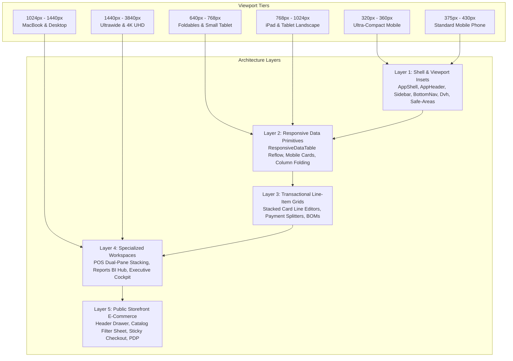
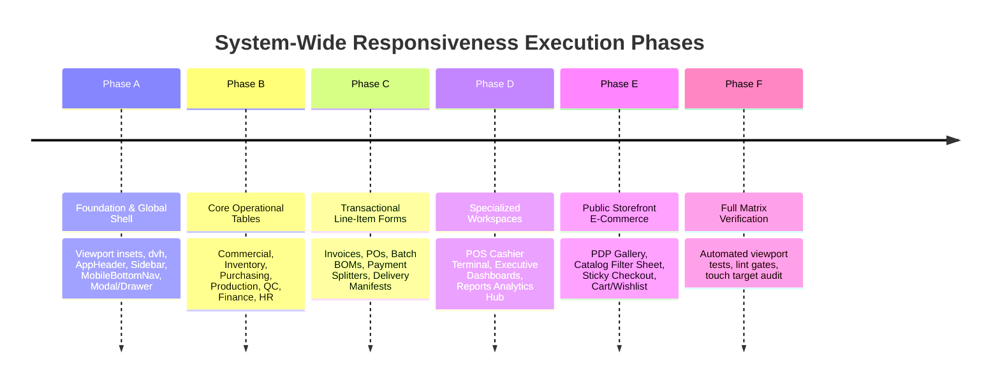

# Master Responsiveness & Cross-Device UI Architecture Plan
> **Target:** 100% Comprehensive Responsiveness Across All Devices, Viewports, and Resolutions  
> **Supported Matrix:** Ultra-Compact Mobile (320px–360px), Standard Mobile (375px–430px), Small Tablets/Foldables (640px–768px), Standard Tablets/Laptops (768px–1024px), Desktop/QHD (1024px–1440px), and Ultrawide/4K (>1440px–3840px).  
> **Status:** Full Audit Complete · Implementation Blueprint Ready for Confirmation

---

## 1. Executive Summary & Audit Diagnostics

An exhaustive audit of the ProERP / SliceMart full-stack frontend (`slicemart-fms/frontend/src/`) was performed, inspecting layout shells, navigation drawers, 18 domain workspaces, public e-commerce storefront pages, point-of-sale terminals, and operational line-item data tables.



### 1.1 Key Audit Findings & Architectural Debt

| Area | Current State | Root Cause & Failure Mode on Mobile/Tablet | Required Resolution |
| :--- | :--- | :--- | :--- |
| **Data Tables** | Over 93 module files use raw `<table>` with `overflow-x-auto`. | On viewports < 768px, 6–10 column tables force blind horizontal scrolling; key data (amounts, status, actions) gets hidden offscreen. | Standardize across all 18 modules on `ResponsiveDataTable` / `DataTable` with automatic card reflow on `< 640px` and priority column folding (`high`/`med`/`low`) on `768px–1023px`. |
| **Header Actions** | `AppHeader` renders 6+ action buttons side-by-side on mobile. | On 320px–375px screens, action buttons collide with the brand logo, causing text truncation or wrapping onto a second line. | Collapse secondary actions (Language, Theme, Quick Tour) into an overflow kebab menu / user sheet on `< 640px`; preserve only Hamburger, Search, Notif, and User. |
| **Line-Item Editors** | Invoice, PO, Batch BOM, and Payment Split editors render wide horizontal input rows. | Min-widths force inputs to squeeze or overflow, making numeric input on touchscreens frustrating and prone to errors. | Implement responsive stacked line-item cards on `< 768px` (Product selector top, Qty/Price/Discount in a 2–3 column touch grid, total + delete at bottom). |
| **Point of Sale (POS)** | `POSShell` dual-pane layout (Catalog + Cart). | Tablet portrait & mobile screens squeeze catalog cards into narrow slivers while cart takes up too much width. | Dynamic tab switcher (`[Catalog | Cart (badge) | Shift]`) with floating sticky checkout bar on `< 1024px`. Keypad inputs expanded to >= 48px touch targets. |
| **Filter & Date Ribbons** | `WorkspaceHeader` & `ReportsWorkspace` filter bars wrap irregularly. | Multiple date pickers, preset pills, and search inputs stack into 4–5 chaotic lines on mobile, pushing data offscreen. | Convert filter ribbons into a compact horizontal touch scroll with a slide-over "Filters & Range" bottom-sheet modal on `< 640px`. |
| **Viewport Units & Insets** | Fixed `90vh` and standard paddings in several modals. | Mobile browser dynamic URL bars (Safari, Chrome) cause content clipping and jitter. Virtual keyboard covers input buttons. | Convert all modals and drawers to `dvh` units (`max-h-[90dvh]`); ensure `pb-safe` and keyboard inset padding across all inputs and submit bars. |
| **Ultrawide & 4K** | Unconstrained `w-full` stretches tables and cards across 3840px. | Reading lines across 3840px causes extreme eye fatigue; KPI cards become unnaturally stretched. | Implement structured max-width bounding (`max-w-[1720px] mx-auto`) with optional high-density grid expansion (4 -> 6 cards on `2xl:` and `3xl:`). |

---

## 2. Cross-Device Resolution & Breakpoint Specification

All components and workspaces will strictly adhere to the unified breakpoint matrix:

```
┌─────────────────────────┬───────────────┬────────────────────────────────────────────────────────┐
│ Breakpoint / Device Tier│ CSS Range     │ Layout Behavior & UX Adaptation                        │
├─────────────────────────┼───────────────┼────────────────────────────────────────────────────────┤
│ xs: Ultra-Compact       │ 320px - 360px │ 1-col cards, icon-only actions, bottom-sheet dialogs,  │
│                         │               │ font size scaling (text-xs/sm), pb-safe insets         │
│ sm: Standard Mobile     │ 361px - 639px │ 1-2 col reflow, card-based tables, persistent bottom   │
│                         │               │ nav, 44px min touch target, sticky bottom CTAs         │
│ md: Small Tablet / Fold │ 640px - 767px │ 2-col grids, priority column folding starts, modal     │
│                         │               │ centered or bottom-sheet adaptive                      │
│ lg: Tablet Landscape    │ 768px - 1023px│ Collapsible sidebar rail, 3-col grids, dual-pane POS   │
│                         │               │ available on toggle, full tabular views                │
│ xl: Laptop / Desktop    │ 1024px - 1439px│ Full sidebar expanded, full multi-column data tables,  │
│                         │               │ side-by-side transaction panels                        │
│ 2xl+: Ultrawide & 4K    │ 1440px - 3840px│ Max-width container bounds (1600px - 1920px),          │
│                         │               │ 4-6 col KPI grids, multi-pane operational telemetry   │
└─────────────────────────┴───────────────┴────────────────────────────────────────────────────────┘
```

---

## 3. Phased Implementation Roadmap

The overhaul is structured into **6 discrete, verifiable phases**. Each phase is atomic, risk-ranked, and preserves 100% test passing rates throughout execution.



---

### Phase A: Global Layout Shell, Viewport Insets & Overlay Primitives
**Goal:** Establish the rock-solid responsive chassis for the entire application, eliminating header wrapping, virtual keyboard jumps, and safe-area clipping.

- **Task A.1: Dynamic Viewport Units (`dvh`) & Safe Area Tokens**
  - Update `tokens.component.css` and `base.css` to enforce dynamic viewport heights (`100dvh`, `min-h-dvh`, `max-h-[90dvh]`).
  - Standardize safe-area utility classes (`pb-safe`, `pt-safe`, `px-safe`).
  - Verify touch-target minimums: 44px min for general UI, 48px for warehouse/factory kiosks, 52px for POS terminals.
- **Task A.2: AppHeader Action Ribbon Optimization**
  - Files: `frontend/src/components/layout/AppHeader.tsx`
  - In viewports `< 640px`:
    - Brand title truncated smoothly with priority badge.
    - Hide secondary standalone buttons (`LanguageSwitcher`, `ThemeToggle`, `TourButton`, `DataBin`).
    - Move secondary actions into the User Profile Drawer / Dropdown.
    - Keep primary quick actions: Hamburger menu toggle, Omnisearch trigger icon, Notifications bell, User Avatar.
  - In viewports `640px–1024px`:
    - Expand Omnisearch bar progressively.
    - Restore Theme toggle and Language switcher.
  - In viewports `>= 1024px`:
    - Full desktop header with branch switcher, Brain shortcut, POS launcher, and search keyboard hint (`Ctrl+K`).
- **Task A.3: Sidebar & Mobile Navigation Integration**
  - Files: `frontend/src/components/layout/Sidebar.tsx`, `frontend/src/components/layout/MobileBottomNav.tsx`
  - Ensure mobile drawer uses `w-[min(20rem,calc(100vw-2.5rem))]` with touch backdrop dismissal.
  - Ensure `MobileBottomNav` has proper `pb-safe` padding for iPhone home indicators and does not overlap page content (enforce `pb-20` on `<main>`).
- **Task A.4: Modal & Drawer Responsiveness Upgrade**
  - Files: `frontend/src/components/ui/Modal.tsx`, `frontend/src/components/layout/SliceMartBrainModal.tsx`
  - Replace any legacy `vh` references with `dvh` (`max-h-[90dvh] sm:max-h-[92dvh]`).
  - Add virtual keyboard awareness to `SliceMartBrainModal` input bar (`pb-safe`, scroll-to-bottom on input focus).
  - Ensure title and header badge stack cleanly on 320px screens.

---

### Phase B: Standardizing Operational Data Tables & Mobile Card Reflow
**Goal:** Convert all raw multi-column tables across the 18 ERP modules to `ResponsiveDataTable` / `DataTable`, giving users desktop tabular density and seamless mobile card reflow.

- **Task B.1: Commercial & Sales Module Reflow**
  - Files:
    - `modules/sales/sections/InvoicesSection.tsx`
    - `modules/sales/sections/SalesOrdersSection.tsx`
    - `modules/sales/sections/CustomersSection.tsx`
    - `modules/sales/sections/PaymentsSection.tsx`
    - `modules/sales/sections/LeadsSection.tsx`
    - `modules/sales/sections/DeliveriesSection.tsx`
    - `modules/sales/sections/SalesReturnsSection.tsx`
  - Implement `ResponsiveDataTable` with `isPrimary`, `isStatus`, `isAction`, and `priority: 'high' | 'medium' | 'low'`.
  - Provide mobile card rendering with 2-column metrics (Total, Paid, Balance, Date) and quick actions.
- **Task B.2: Inventory & Warehouse Module Reflow**
  - Files:
    - `modules/inventory/sections/StockLedgerSection.tsx`
    - `modules/inventory/sections/StockTransfersSection.tsx`
    - `modules/inventory/sections/StockThresholdsSection.tsx`
    - `modules/inventory/sections/StockCountsSection.tsx`
    - `modules/inventory/sections/StockAdjustmentsSection.tsx`
  - Table card reflow with barcode/SKU chip, quantity in stock, warehouse location, and adjustment status.
- **Task B.3: Purchasing & Procurement Module Reflow**
  - Files:
    - `modules/purchasing/sections/PurchaseOrdersSection.tsx`
    - `modules/purchasing/sections/PurchaseBillsSection.tsx`
    - `modules/purchasing/sections/GoodsReceiptsSection.tsx`
    - `modules/purchasing/sections/PurchaseRequisitionsSection.tsx`
    - `modules/purchasing/sections/PurchaseReturnsSection.tsx`
  - Table card reflow with Supplier name, PO number, receiving progress bar, and approval badge.
- **Task B.4: Production & Quality Control Module Reflow**
  - Files:
    - `modules/production/sections/ProductionBatchesSection.tsx`
    - `modules/production/sections/ProductionPlansSection.tsx`
    - `modules/production/sections/WorkerProductionSection.tsx`
    - `modules/qc/sections/QcInspectionsSection.tsx`
    - `modules/qc/sections/QcParametersSection.tsx`
    - `modules/qc/sections/WastageRecordsSection.tsx`
    - `modules/qc/sections/ReworkSection.tsx`
  - Card reflow with Batch ID, Recipe name, progress ring, defect counts, and inspection pass/fail badge.
- **Task B.5: Finance, HR & Platform Admin Reflow**
  - Files:
    - `modules/finance/sections/ExpensesSection.tsx`
    - `modules/finance/sections/BankAccountsSection.tsx`
    - `modules/finance/sections/CustomerReceivablesSection.tsx`
    - `modules/finance/sections/VendorPayablesSection.tsx`
    - `modules/hr/sections/EmployeesSection.tsx`
    - `modules/hr/sections/AttendanceSection.tsx`
    - `modules/hr/sections/PayrollSection.tsx`
    - `pages/settings/UsersManagementWorkspace.tsx`
    - `pages/settings/ActivityLogWorkspace.tsx`
    - `pages/settings/DataBinWorkspace.tsx`
    - `modules/platform/PlatformAuditWorkspace.tsx`
    - `modules/platform/PlatformPaymentsWorkspace.tsx`

---

### Phase C: Complex Multi-Column Transaction Forms & Line-Item Grids
**Goal:** Prevent form squishing and input illegibility on screens < 768px by transforming multi-column line tables into touch-first stacked card editors.

- **Task C.1: Multi-Tender Payment Split Editor Stack**
  - File: `components/payment/PaymentSplitEditor.tsx`
  - In viewports `< 640px`:
    - Transform split row from horizontal `flex` to vertical stacked card:
      - Line header: `#{index + 1}` index pill + Delete button.
      - Body: Full-width Method selection dropdown.
      - Body row 2: Full-width Amount input with auto-balance shortcut.
      - Expanded details: Full-width Transaction Ref, Bank Account, or Mobile Provider.
    - Allocation summary bar: Stack total vs split sum vertically on 320px screens.
- **Task C.2: Sales Invoice & Order Line-Item Card Editor**
  - Files: `modules/sales/components/OrderProcessingModal.tsx`, Direct Invoice Editor
  - In viewports `>= 768px`: Tabular row (SKU, Item, Qty, Unit Price, Tax, Subtotal, Delete).
  - In viewports `< 768px`: Stacked line item card:
    - Card header: Product search / dropdown + delete trash icon.
    - Card grid: 2-column input grid:
      - Column 1: Quantity stepper (`-` `[number]` `+`).
      - Column 2: Unit Price (`৳ 0.00`).
    - Card row 3: Discount & Tax inputs.
    - Card footer: Calculated line subtotal in bold monospace font.
- **Task C.3: Purchase Bill & Goods Receipt Line-Item Editor**
  - Files: `modules/purchasing/` line-item editors
  - Implement matching stacked card pattern for PO lines and inward receipt tallies.
- **Task C.4: Production Batch Bill of Materials (BOM) & Recipe Editor**
  - Files: `modules/production/` recipe and batch creation forms
  - Stack ingredient allocations (Raw material, standard qty, actual issued, wastage variance) on mobile.

---

### Phase D: Specialized Workspaces (POS, Analytics BI Hub, Executive Dashboards)
**Goal:** Deliver responsive adaptations for high-complexity specialized interfaces.

- **Task D.1: Point of Sale (POS) Adaptive Cashier Workspace**
  - Files: `modules/pos/PosWorkspace.tsx`, `modules/pos/POSShell.tsx`, `modules/pos/POSShell.css`
  - In viewports `< 1024px`:
    - Activate mobile view controller: segmented toggle bar `[Catalog (n) | Cart (badge) | Held Orders | Shift]`.
    - Floating sticky checkout summary bar at bottom of catalog view showing line items count, grand total, and "Review Cart →" button.
    - Cart panel takes 100% viewport width when active with "← Back to Catalog" top bar.
  - In viewports `>= 1024px`:
    - Full dual-pane POS terminal layout with catalog grid on left and order ticket on right.
  - POS Numpad & Quick Payment Tender:
    - On mobile / touchscreens, buttons expand to minimum 52px height for rapid error-free cashier input.
    - Modal dialogs (Mid-shift X-report, Refund/Return, Exchange) render as full-height or 90dvh sheets.
- **Task D.2: Reports & Business Intelligence Hub**
  - Files: `modules/reports/ReportsWorkspace.tsx`, `modules/reports/components/ReportChartAnalytics.tsx`
  - Convert top date preset buttons into horizontal touch-scrollable strip with fade masks.
  - Wrap date range pickers into a responsive popover/drawer on `< 640px`.
  - Chart containers use adaptive aspect ratio: `aspect-16/9` on mobile, `aspect-21/9` on desktop.
  - Metric summary cards: `grid-cols-1 sm:grid-cols-2 lg:grid-cols-4`.
- **Task D.3: Executive & Role Dashboard Command Bars**
  - Files: `pages/dashboard/TenantRoleDashboard.tsx`, `pages/dashboard/components/`
  - Reflow KPI command bar: `grid-cols-1 sm:grid-cols-2 md:grid-cols-3 xl:grid-cols-6`.
  - On 320px–360px phones, single-column KPI presentation with font size clamp (`text-lg sm:text-xl`) to prevent number overflow.
  - Quick action grid reflows from 2 columns on mobile to 4 on tablet and 8 on desktop.

---

### Phase E: Public Headless Storefront & E-Commerce Mobile Excellence
**Goal:** Ensure the consumer-facing shopping experience is flawless on all mobile smartphones, tablets, and high-DPI desktop screens.

- **Task E.1: Storefront Shell & Navigation Header**
  - Files: `components/storefront/StorefrontHeader.tsx`, `components/storefront/StorefrontShell.tsx`
  - Mobile slide-over navigation drawer with category links, WhatsApp direct ordering, tracking, and language toggle.
  - Sticky announcement ticker with single-line truncation on mobile and full trust badges on desktop.
- **Task E.2: Storefront Catalog Page & Faceted Search**
  - Files: `pages/storefront/StorefrontCatalogPage.tsx`
  - On viewports `< 1024px`: Filter sidebar transforms into a slide-up "Filter & Sort" bottom-sheet drawer with badge counter.
  - Product grid: 2 columns on mobile (`grid-cols-2`), 3 on tablet (`sm:grid-cols-3`), 4 on desktop (`lg:grid-cols-4`).
- **Task E.3: Storefront Product Detail Page (PDP)**
  - Files: `pages/storefront/StorefrontProductDetailPage.tsx`
  - Mobile swipeable image gallery with dot indicators.
  - Sticky bottom "Add to Cart" bar on mobile (< 768px) with price display, quantity stepper, and primary button.
- **Task E.4: Storefront Checkout & Order Tracking**
  - Files: `pages/storefront/StorefrontCheckoutPage.tsx`, `pages/storefront/StorefrontOrderTrackingPage.tsx`
  - In viewports `< 768px`: Cart summary moves into an expandable accordion above customer details.
  - Payment method selection pills stack cleanly into 2 columns on mobile without text clipping.
  - Order tracking timeline reflows into a vertical stepper on mobile with tap-to-call delivery rider.

---

### Phase F: Comprehensive Automated Verification & Quality Gates
**Goal:** Validate all responsive behaviors across the entire resolution spectrum with zero errors and 100% test pass rate.

- **Task F.1: Automated Viewport Unit & Component Tests**
  - Create `frontend/src/test/responsive-viewport.test.tsx` testing:
    - `ResponsiveDataTable` reflow under mobile (<640px) vs tablet (768px) vs desktop (1024px) conditions.
    - `PaymentSplitEditor` stacking classes on narrow viewports.
    - `AppHeader` collapsed icon priorities.
    - Touch-target sizes (verifying min 44px/48px utility classes).
- **Task F.2: TypeScript & Static Lint Verification**
  - Run `npx tsc -b --noEmit` -> Must yield 0 errors.
  - Run `npm run lint` -> Must pass cleanly.
- **Task F.3: Full Vitest Regression Suite Run**
  - Run `npx vitest run` -> 100% pass across all test files (currently 46 files, 319 tests).
- **Task F.4: Cross-Device Visual Audit Matrix Checklist**
  - Verify every screen in headless browser at:
    - 320px x 568px (iPhone SE 1st Gen)
    - 375px x 667px (iPhone SE 2nd/3rd Gen)
    - 390px x 844px (iPhone 13 / 14 / 15)
    - 430px x 932px (iPhone 14 / 15 / 16 Pro Max)
    - 768px x 1024px (iPad Portrait)
    - 1024px x 768px (iPad Landscape)
    - 1280px x 800px (Laptop / Chromebook)
    - 1920px x 1080px (FHD Desktop)
    - 2560px x 1440px (QHD / 2K Display)
    - 3840px x 2160px (4K UHD)

---

## 4. Execution Checkpoints & Safety Guarantees

1. **Zero Production Breakage**: All existing API contracts, database models, permissions, and business rules remain strictly intact.
2. **Atomic Commits by Phase**: Each phase (A through F) is verified independently before progressing to the next.
3. **No Raw Inline Widths**: Deprecate any hardcoded pixel widths (`w-[500px]`, `min-w-[600px]`) in favor of responsive token-bound widths (`w-full max-w-lg`, `min-w-0`).
4. **Touch Ergonomics First**: All buttons, links, and form inputs on touch viewports strictly respect the thumb zone and >= 44px tap boundaries.

---

## 5. Next Steps

Please confirm to proceed with **Phase A (Global Shell, Viewport Insets & Overlay Primitives)** or specify any adjustments to the prioritization.
